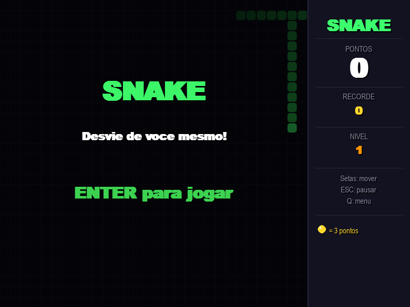

# Snake

Jogo da cobra clássico com visual moderno em tema neon — grade escura, cobra gradiente, efeitos de partículas e sistema de pontuação com recorde local.



## Funcionalidades

- **Visual neon** — fundo escuro `#0D0D17` com grade sutil, cobra com gradiente verde e olhos animados
- **Maçã pulsante** — efeito de brilho e pulso na comida; maçã dourada a cada 7 itens (+3 pontos)
- **Progressão de velocidade** — começa em 8 movimentos/s e sobe até 22 conforme o nível
- **Partículas** — explosão de partículas ao comer e ao morrer
- **Flash vermelho** — tela pisca em vermelho na morte
- **Pausa** — tecla P pausa o jogo a qualquer momento
- **Recorde local** — pontuação máxima salva em `highscore.json`
- **Painel lateral** — exibe pontos, recorde e nível em tempo real

## Controles

| Tecla | Ação |
|-------|------|
| `↑ ↓ ← →` | Mover a cobra |
| `W A S D` | Mover a cobra (alternativo) |
| `Enter` | Iniciar / reiniciar |
| `P` | Pausar / retomar |
| `Esc` | Sair |

## Requisitos

- Python 3.8+
- Pygame 2.x

```bash
pip install pygame
```

## Como jogar

```bash
python snake.py
```

## Estrutura

```
game-snake/
├── snake.py          # Jogo principal
├── highscore.json    # Recorde salvo automaticamente
├── coin.wav          # Som ao comer
├── Invincible.mp3    # Música de fundo
└── screenshot.png    # Tela inicial
```
